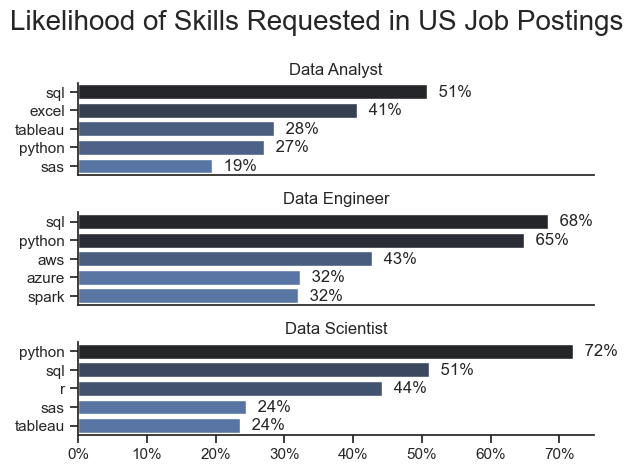
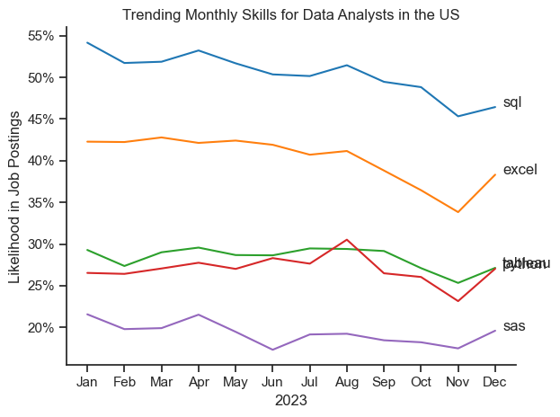
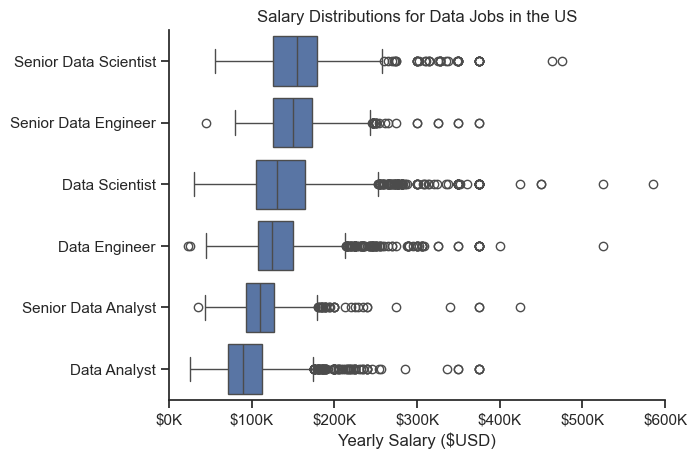
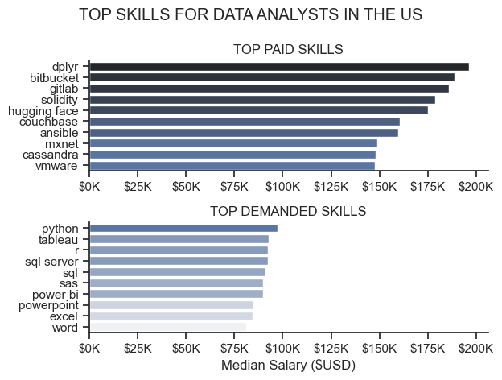
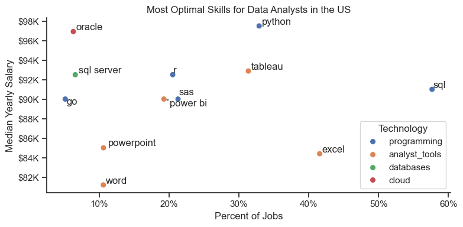

# 📊 Data Jobs Market Analysis
An in-depth exploration of the data job market focusing on **Data Analyst roles**—analyzing top-paying skills, in-demand competencies, and optimal career strategies.

# 🎯 Project Overview
This project was created out of a desire to navigate and understand the data job market more effectively. It delves into the top-paying and in-demand skills to help identify **optimal job opportunities for data analysts**.

The data is sourced from **[Luke Barousse's Python Course](https://github.com/lukebarousse/Python_Data_Analytics_Course)**, providing a foundation for analysis with detailed information on job titles, salaries, locations, and essential skills.

# 📋 Key Questions Answered
1. 	What are the most demanded skills for the top 3 data roles?
2. 	How are in-demand skills trending for Data Analysts?
3. 	How well do jobs and skills pay for Data Analysts?
4. 	What are the optimal skills for data analysts to learn (High Demand + High Paying)?

# 🛠️ Tools & Libraries Used
1. **Python:**      Core analysis language
2. **Pandas:** 	    Data manipulation & analysis
3. **Matplotlib:**	Data visualization
4. **Seaborn:**    	Advanced statistical visuals
5. **Jupyter:**     Notebook	Interactive development environment
6. **GitHub:**	    Version control & project sharing

# 📥 Data Preparation & Cleanup
```
# Importing Libraries
import pandas as pd
import matplotlib.pyplot as plt
import seaborn as sns
import ast

# Loading Dataset
df = pd.read_csv(r'C:\Users\ARJUN\Python_projects\Python_Course\data_jobs.csv')

# Data Cleanup
df['job_posted_date'] = pd.to_datetime(df['job_posted_date'])
df['job_skills'] = df['job_skills'].apply(lambda skill_list: ast.literal_eval(skill_list) if pd.notna(skill_list) else skill_list)
```

# 📈 Analysis & Results
## 1️⃣ Most Demanded Skills for Top 3 Data Roles
**Approach:** Filtered the 3 most popular data roles and identified their top 5 skills.

## Visualize Data
```
fig, ax = plt.subplots(len(job_roles), 1)

sns.set_theme(style = 'ticks')

for i, job in enumerate(job_roles):
    df_plot = df_skills_perc[df_skills_perc['job_title_short'] == job].head()
    sns.barplot(data = df_plot, x = 'skill_percent', y = 'job_skills', ax = ax[i], hue = 'skill_percent', palette = 'dark:b_r')
    sns.despine()
    ax[i].set_title(job)
    ax[i].set_xlabel('')
    ax[i].set_ylabel('')
    ax[i].legend().remove()
    ax[i].set_xlim(0,75)
    ax[i].xaxis.set_major_formatter(plt.FuncFormatter(lambda x, _: f'{int(x)}%'))

    if i != len(job_roles) - 1:
        ax[i].set_xticks([])
        
    for index, value in enumerate(df_plot['skill_percent']):
        ax[i].text(value + 1, index, f'{value: .0f}%', va = 'center')
    
fig.suptitle('Likelihood of Skills Requested in US Job Postings', fontsize = 20)
fig.tight_layout(h_pad = 1.0)
plt.show()
```

## Results


**Key Insights:**
1. SQL is the most requested skill for Data Analysts (51%) and Data Engineers (72%)
2. Python dominates for Data Scientists (72%)
3. Data Engineers need specialized technical skills (AWS, Azure, Spark)
4. Python is versatile across all three roles (72% for Data Scientists, 65% for Data Engineers)


## 2️⃣ Trending Skills for Data Analysts (2023)
**Approach:** Grouped skills by month to track demand changes throughout the year.

## Visualize Data
```
df_plot = df_DA_US_perc.iloc[:,:5]

sns.set_theme(style = 'ticks')

sns.lineplot(data = df_plot, palette = 'tab10', dashes = False)
sns.despine()
plt.title('Trending Monthly Skills for Data Analysts in the US')
plt.xlabel('2023')
plt.ylabel('Likelihood in Job Postings')
plt.gca().yaxis.set_major_formatter(plt.FuncFormatter(lambda y, _: f'{int(y)}%'))
plt.legend().set_visible(False)

for i in range(5):
    plt.text(11.2, df_plot.iloc[-1,i], df_plot.columns[i]) # fetching the last value of each column

plt.tight_layout()
plt.show()
```

## Results


**Key Insights:**
1. SQL remains most consistently demanded, though gradually decreasing
2. Excel surged in demand from September, surpassing Python/Tableau by year-end
3. Python & Tableau show stable demand with minor fluctuations
4. Power BI shows slight upward trend toward year's end


## 3️⃣ Salary Analysis for Data Jobs & Skills
**Approach:** Analyzed salary distributions across job titles, then compared highest-paid vs. most in-demand skills.

## Visualize Data
```
# df_plot = [df_US['salary_year_avg'][df_US['job_title_short'] == job_title] for job_title in job_titles]
# plt.boxplot(df_plot, vert = False, labels = job_titles)

sns.set_theme(style = 'ticks')

(
    sns.boxplot(
    data = df_US[df_US['job_title_short'].isin(job_titles)], x = 'salary_year_avg', y = 'job_title_short', 
    
    order = df_US[df_US['job_title_short'].isin(job_titles)].groupby('job_title_short')['salary_year_avg'].agg('median')
    .sort_values(ascending = False).index)
)
sns.despine()
plt.title('Salary Distributions for Data Jobs in the US')
plt.xlabel('Yearly Salary ($USD)')
plt.ylabel('')
plt.gca().xaxis.set_major_formatter(plt.FuncFormatter(lambda x, _: f'${int(x/1000)}K'))
plt.xlim(0,600000)
plt.show()
```

## Results


## Salary Distribution Insights:
1. **Senior Data Scientist** has highest earning potential (up to $600K)
2. Senior roles show larger salary variance
3. Specialized technical skills **(dplyr, Bitbucket, Gitlab)** command $200K+
4. Foundational skills **(Excel, PowerPoint, SQL)** are most in-demand despite lower pay

**Highest Paid vs. Most Demanded Skills:**
```
fig, ax = plt.subplots(2,1)

sns.set_theme(style = 'ticks')

# df_top_paid.plot(kind = 'barh', y = 'Median_Salary', ax = ax[0])
# ax[0].invert_yaxis()
sns.barplot(data = df_top_paid, x = 'Median_Salary', y = df_top_paid.index, ax = ax[0], hue = 'Median_Salary', palette = 'dark:b_r')
ax[0].set_title('TOP PAID SKILLS')
ax[0].legend().set_visible(False)
ax[0].set_xlabel('')
ax[0].set_ylabel('')
ax[0].xaxis.set_major_formatter(plt.FuncFormatter(lambda x, _: f'${int(x/1000)}K'))

# df_top_demanded.plot(kind = 'barh', y = 'Median_Salary', ax = ax[1])
# ax[1].invert_yaxis()
sns.barplot(data = df_top_demanded, x = 'Median_Salary', y = df_top_demanded.index, ax = ax[1], hue = 'Median_Salary', palette = 'light:b')
ax[1].set_title('TOP DEMANDED SKILLS')
ax[1].legend().remove()
ax[1].set_xlabel('Median Salary ($USD)')
ax[1].set_ylabel('')
ax[1].xaxis.set_major_formatter(plt.FuncFormatter(lambda x, _: f'${int(x/1000)}K'))
ax[1].set_xlim(ax[0].get_xlim())

sns.despine()
fig.suptitle('TOP SKILLS FOR DATA ANALYSTS IN THE US')
fig.tight_layout(h_pad = 1.0)
plt.show()
```

## Results


**Key Insights:**
1. Specialized technical skills command premium salaries
2. Foundational skills drive employability


## 4️⃣ Optimal Skills for Data Analysts
**Approach:** Plotted skill demand percentage vs. median salary to identify high-value skills.

## Visualize Data
```
from adjustText import adjust_text

plt.figure(figsize = (8,4))

# df_DA_US_pivot_high_demand_skills.plot(kind = 'scatter', x = 'Skill_Percent', y = 'Median_Salary')

sns.set_theme(style = 'ticks')

sns.scatterplot(data = df_plot, x = 'Skill_Percent', y = 'Median_Salary', hue = 'Technology', s = 50)
sns.despine()
plt.title('Most Optimal Skills for Data Analysts in the US')
plt.xlabel('Percent of Jobs')
plt.ylabel('Median Yearly Salary')
plt.gca().xaxis.set_major_formatter(plt.FuncFormatter(lambda x, _: f'{int(x)}%'))
plt.gca().yaxis.set_major_formatter(plt.FuncFormatter(lambda y, _: f'${int(y/1000)}K'))

texts = []
for i, txt in enumerate(df_DA_US_pivot_high_demand_skills.index):
    texts.append(plt.text(df_DA_US_pivot_high_demand_skills['Skill_Percent'].iloc[i], df_DA_US_pivot_high_demand_skills['Median_Salary'].iloc[i], txt))

adjust_text(texts, arrowprops = dict(arrowstyle = '->', lw = 2, color = 'gray'))
plt.tight_layout()
plt.show()
```

## Results


**Key Insights:**
1. **Oracle** offers highest median salary ($97K) despite lower demand
2. **Python** & **Tableau** balance good salary with moderate demand
3. Programming skills cluster at higher salary levels
4. Database skills **(Oracle, SQL Server)** command top salaries
5. Visualization tools **(Tableau, Power BI)** offer competitive pay with high demand


# 💡 What I Learned
1. **Advanced Python**:	    Pandas, Seaborn, Matplotlib for complex data analysis
2. **Data Cleaning**:	    Parsing nested lists with ```ast.literal_eval()```, handling null values
3. **Strategic Analysis**:	Aligning skill development with market demand for career planning
4. **Visualization**:    	Creating multi-plot figures, managing subplot layouts, using ```adjustText```

# 🚧 Challenges Overcome
1. **Data Inconsistencies:**         Implemented thorough cleaning for missing/irregular entries
2. **Complex Visualizations:**       Used ```adjustText``` to manage overlapping labels on scatter plots
3. **Balancing Depth & Breadth:**    Maintained comprehensive coverage without losing detail
4. **Multi-plot Layouts:**           Managed subplot sizing and spacing with ```fig.tight_layout()```

# 📝 Conclusion
This exploration into the data analyst job market reveals a **clear correlation between specialized skills and higher salaries**. Programming and database skills command premium compensation, while foundational tools like **Excel** and **SQL** remain essential for employability.

The dynamic nature of skill trends emphasizes the importance of **continuous learning** in data analytics. Understanding the balance between skill demand and compensation can guide strategic career development in this evolving field.
